# Execution Plan — Expense Splitter

## Detailed Analysis Summary

### Change Impact Assessment
- **User-facing changes**: Yes — full SPA with dashboard, expense entry, settlement flow
- **Structural changes**: Yes — brand new 3-layer architecture (REST API + balance engine + frontend SPA)
- **Data model changes**: Yes — new schema: groups, members, expenses, splits, settlements
- **API changes**: Yes — new REST API (no prior API exists)
- **NFR impact**: Yes — Security Baseline (full), PBT (partial), AWS cloud deployment

### Risk Assessment
- **Risk Level**: Medium-High
- **Rationale**: New system from scratch with non-trivial algorithm (debt simplification), OAuth2 integration, full Security Baseline (15 rules), AWS deployment, and 3 independently-designable layers
- **Rollback Complexity**: Low — greenfield, no production system to roll back
- **Testing Complexity**: Complex — PBT for balance engine, integration tests against real DB, OAuth2 mock needed for tests

---

## Workflow Visualization

```mermaid
flowchart TD
    Start(["User Request"])

    subgraph INCEPTION["INCEPTION PHASE"]
        WD["Workspace Detection\nCOMPLETED"]
        RE["Reverse Engineering\nSKIPPED - Greenfield"]
        RA["Requirements Analysis\nCOMPLETED"]
        US["User Stories\nCOMPLETED"]
        WP["Workflow Planning\nIN PROGRESS"]
        AD["Application Design\nEXECUTE"]
        UG["Units Generation\nEXECUTE"]
    end

    subgraph CONSTRUCTION["CONSTRUCTION PHASE"]
        subgraph UNIT1["Unit 1 - Backend API and Data Layer"]
            FD1["Functional Design\nEXECUTE"]
            NFRA1["NFR Requirements\nEXECUTE"]
            NFRD1["NFR Design\nEXECUTE"]
            ID1["Infrastructure Design\nEXECUTE"]
            CG1["Code Generation\nEXECUTE"]
        end
        subgraph UNIT2["Unit 2 - Balance Engine"]
            FD2["Functional Design\nEXECUTE"]
            NFRA2["NFR Requirements\nEXECUTE"]
            NFRD2["NFR Design\nEXECUTE"]
            CG2["Code Generation\nEXECUTE"]
        end
        subgraph UNIT3["Unit 3 - Frontend SPA"]
            FD3["Functional Design\nEXECUTE"]
            CG3["Code Generation\nEXECUTE"]
        end
        BT["Build and Test\nEXECUTE"]
    end

    subgraph OPERATIONS["OPERATIONS PHASE"]
        OPS["Operations\nPLACEHOLDER"]
    end

    Start --> WD
    WD --> RA
    RA --> US
    US --> WP
    WP --> AD
    AD --> UG
    UG --> FD1
    FD1 --> NFRA1 --> NFRD1 --> ID1 --> CG1
    CG1 --> FD2
    FD2 --> NFRA2 --> NFRD2 --> CG2
    CG2 --> FD3
    FD3 --> CG3
    CG3 --> BT
    BT -.-> OPS
    BT --> End(["Complete"])

    style WD fill:#4CAF50,stroke:#1B5E20,stroke-width:3px,color:#fff
    style RA fill:#4CAF50,stroke:#1B5E20,stroke-width:3px,color:#fff
    style US fill:#4CAF50,stroke:#1B5E20,stroke-width:3px,color:#fff
    style WP fill:#4CAF50,stroke:#1B5E20,stroke-width:3px,color:#fff
    style BT fill:#4CAF50,stroke:#1B5E20,stroke-width:3px,color:#fff
    style CG1 fill:#4CAF50,stroke:#1B5E20,stroke-width:3px,color:#fff
    style CG2 fill:#4CAF50,stroke:#1B5E20,stroke-width:3px,color:#fff
    style CG3 fill:#4CAF50,stroke:#1B5E20,stroke-width:3px,color:#fff
    style RE fill:#BDBDBD,stroke:#424242,stroke-width:2px,stroke-dasharray:5 5,color:#000
    style AD fill:#FFA726,stroke:#E65100,stroke-width:3px,stroke-dasharray:5 5,color:#000
    style UG fill:#FFA726,stroke:#E65100,stroke-width:3px,stroke-dasharray:5 5,color:#000
    style FD1 fill:#FFA726,stroke:#E65100,stroke-width:3px,stroke-dasharray:5 5,color:#000
    style NFRA1 fill:#FFA726,stroke:#E65100,stroke-width:3px,stroke-dasharray:5 5,color:#000
    style NFRD1 fill:#FFA726,stroke:#E65100,stroke-width:3px,stroke-dasharray:5 5,color:#000
    style ID1 fill:#FFA726,stroke:#E65100,stroke-width:3px,stroke-dasharray:5 5,color:#000
    style FD2 fill:#FFA726,stroke:#E65100,stroke-width:3px,stroke-dasharray:5 5,color:#000
    style NFRA2 fill:#FFA726,stroke:#E65100,stroke-width:3px,stroke-dasharray:5 5,color:#000
    style NFRD2 fill:#FFA726,stroke:#E65100,stroke-width:3px,stroke-dasharray:5 5,color:#000
    style FD3 fill:#FFA726,stroke:#E65100,stroke-width:3px,stroke-dasharray:5 5,color:#000
    style OPS fill:#BDBDBD,stroke:#424242,stroke-width:2px,stroke-dasharray:5 5,color:#000
    style INCEPTION fill:#BBDEFB,stroke:#1565C0,stroke-width:3px,color:#000
    style CONSTRUCTION fill:#C8E6C9,stroke:#2E7D32,stroke-width:3px,color:#000
    style OPERATIONS fill:#FFF59D,stroke:#F57F17,stroke-width:3px,color:#000
    style Start fill:#CE93D8,stroke:#6A1B9A,stroke-width:3px,color:#000
    style End fill:#CE93D8,stroke:#6A1B9A,stroke-width:3px,color:#000
    linkStyle default stroke:#333,stroke-width:2px
```



### Text Alternative

```
INCEPTION PHASE
  [x] Workspace Detection          — COMPLETED
  [-] Reverse Engineering          — SKIPPED (Greenfield)
  [x] Requirements Analysis        — COMPLETED
  [x] User Stories                 — COMPLETED
  [>] Workflow Planning            — IN PROGRESS
  [ ] Application Design           — EXECUTE
  [ ] Units Generation             — EXECUTE

CONSTRUCTION PHASE
  Unit 1: Backend API & Data Layer
    [ ] Functional Design          — EXECUTE
    [ ] NFR Requirements           — EXECUTE
    [ ] NFR Design                 — EXECUTE
    [ ] Infrastructure Design      — EXECUTE
    [ ] Code Generation            — EXECUTE (ALWAYS)
  Unit 2: Balance Engine
    [ ] Functional Design          — EXECUTE
    [ ] NFR Requirements           — EXECUTE
    [ ] NFR Design                 — EXECUTE
    [ ] Code Generation            — EXECUTE (ALWAYS)
  Unit 3: Frontend SPA
    [ ] Functional Design          — EXECUTE
    [ ] Code Generation            — EXECUTE (ALWAYS)
  [ ] Build and Test               — EXECUTE (ALWAYS)

OPERATIONS PHASE
  [ ] Operations                   — PLACEHOLDER
```

---

## Phases to Execute

### INCEPTION PHASE
- [x] Workspace Detection — COMPLETED
- [-] Reverse Engineering — SKIPPED (Greenfield, no existing code)
- [x] Requirements Analysis — COMPLETED
- [x] User Stories — COMPLETED
- [>] Workflow Planning — IN PROGRESS
- [ ] Application Design — **EXECUTE**
  - **Rationale**: New system with 3 distinct layers and 5+ components needing interface definition. Component methods (split calculators, debt algorithm, balance aggregator) and inter-layer dependencies must be designed before code generation.
- [ ] Units Generation — **EXECUTE**
  - **Rationale**: System decomposes naturally into 3 independent units (Backend API, Balance Engine, Frontend SPA) enabling focused design treatment per unit, especially for the non-trivial balance engine.

### CONSTRUCTION PHASE — Unit 1: Backend API & Data Layer

- [ ] Functional Design — **EXECUTE**
  - **Rationale**: New data models (Group, Member, Expense, SplitRule, Settlement), REST API contract, ORM schema, and auth flow need detailed design before code generation.
- [ ] NFR Requirements — **EXECUTE**
  - **Rationale**: 15 Security Baseline rules require explicit NFR decisions: JWT configuration, CORS origins, rate limiting strategy, connection pooling, Alembic migration setup.
- [ ] NFR Design — **EXECUTE**
  - **Rationale**: Security patterns (auth middleware, input validation decorators, error handler) must be designed and incorporated into the component model.
- [ ] Infrastructure Design — **EXECUTE**
  - **Rationale**: AWS deployment (ECS Fargate vs Lambda), RDS PostgreSQL, ALB, VPC subnets, IAM roles, and secrets management need specification before IaC is written.
- [ ] Code Generation — EXECUTE (ALWAYS)

### CONSTRUCTION PHASE — Unit 2: Balance Engine

- [ ] Functional Design — **EXECUTE**
  - **Rationale**: Debt-simplification algorithm (minimum transfer graph), split calculators (4 types), and rounding rules are non-trivial and require detailed design with PBT property identification (PBT-01).
- [ ] NFR Requirements — **EXECUTE**
  - **Rationale**: PBT framework selection (Hypothesis), generator design for domain types, and performance constraints (O(n log n) target) need documenting.
- [ ] NFR Design — **EXECUTE**
  - **Rationale**: PBT strategy (generators, invariants, oracle tests) needs designing alongside the algorithmic components.
- [ ] Infrastructure Design — SKIPPED
  - **Rationale**: Balance engine is an in-process Python module — no independent infrastructure. Covered under Unit 1 infrastructure.
- [ ] Code Generation — EXECUTE (ALWAYS)

### CONSTRUCTION PHASE — Unit 3: Frontend SPA

- [ ] Functional Design — **EXECUTE**
  - **Rationale**: Component hierarchy (React), routing structure, API client design, and state management approach need design before code generation.
- [ ] NFR Requirements — SKIPPED
  - **Rationale**: No new tech stack decisions for frontend (React/TypeScript already determined). Security headers enforced at API/CDN level, not in SPA code. No independent NFR concerns beyond what Unit 1 covers.
- [ ] NFR Design — SKIPPED
  - **Rationale**: NFR Requirements skipped; no NFR patterns to incorporate independently.
- [ ] Infrastructure Design — SKIPPED
  - **Rationale**: Frontend is a static build deployed to S3/CloudFront — covered under Unit 1 infrastructure design.
- [ ] Code Generation — EXECUTE (ALWAYS)

### CONSTRUCTION PHASE
- [ ] Build and Test — EXECUTE (ALWAYS)

### OPERATIONS PHASE
- [ ] Operations — PLACEHOLDER

---

## Units of Work

| Unit | Scope | Key Design Concerns |
|---|---|---|
| Unit 1 — Backend API & Data Layer | FastAPI app, Pydantic models, SQLAlchemy ORM, Alembic migrations, OAuth2 auth, all CRUD endpoints | Security Baseline enforcement, JWT middleware, input validation, error handling, DB schema |
| Unit 2 — Balance Engine | Split calculators (4 types), balance aggregator, debt-simplification algorithm, rounding logic | PBT (partial), O(n log n) performance, oracle tests, currency-isolated computation |
| Unit 3 — Frontend SPA | React/TypeScript app, all 6 screens, API client, routing, state management | UI/UX from stories, CSP headers, SRI for any CDN assets, accessibility |

---

## Success Criteria
- **Primary Goal**: A running Expense Splitter web application with REST API + balance engine + React SPA
- **Key Deliverables**: Working code for all 3 units, Alembic migrations, Docker config, IaC (AWS), comprehensive tests
- **Quality Gates**:
  - All 16 user stories have passing acceptance criteria tests
  - Security Baseline (SECURITY-01 to SECURITY-15) compliant at code generation stage
  - PBT-02, 03, 07, 08, 09 compliant for balance engine
  - Application runs locally with SQLite and in Docker with PostgreSQL
